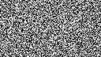

# Adaptive Sampling in Monte Carlo Ray Tracing

This project explores adaptive per-pixel sampling in a simple Monte Carlo ray tracer.

Instead of giving every pixel the same number of samples, the program uses an evolutionary hill-climbing optimizer to search for a samples-per-pixel map. Pixels that are harder to render can receive more samples, while simpler pixels can receive fewer.

The ray tracing code is intentionally simple and is based on *Ray Tracing in One Weekend*. The focus of this project is the optimization idea, not building a complex renderer.

## What The Project Shows

- A high-sample reference render.
- A final render using an optimized per-pixel sampling map.
- A grayscale SPP map that visualizes the final samples-per-pixel choices.

## Example Output

| Reference | Adaptive Result | SPP Map |
| --- | --- | --- |
|  |  |  |

In the SPP map:

- Darker pixels used fewer samples.
- Brighter pixels used more samples.

This makes the optimizer easier to explain because the project does not only show the final image; it also shows the sampling decisions behind that image. In this small demo scene, the map can still look noisy because the renderer and optimizer are intentionally simple.

## How It Works

1. Render a high-sample reference image.
2. Create random sampling maps.
3. Render candidate images using those maps.
4. Measure each candidate with mean squared error against the reference.
5. Keep the better candidate.
6. Mutate the winner to create the next candidate.
7. Save the final adaptive render and the final SPP map.

## Build And Run

```bash
cmake -S . -B build
cmake --build build
./build/Ray_Tracer
```

The program writes these files in the directory where it is run:

```text
reference.ppm
ga_result.ppm
spp_map.ppm
```

Many image viewers can open `.ppm` files directly. If needed, they can also be converted to `.png` with ImageMagick:

```bash
magick reference.ppm reference.png
magick ga_result.ppm ga_result.png
magick spp_map.ppm spp_map.png
```

## Portfolio Explanation

This project demonstrates adaptive sampling for Monte Carlo ray tracing. A simple evolutionary hill-climbing algorithm searches for how many samples each pixel should receive. The final render uses the optimized sampling map, and the SPP visualization shows where the program spent more computation.

## Main Files

- `main.cpp`: builds the scene, runs the optimization loop, and saves output images.
- `camera.h`: simple ray tracing camera and render-to-buffer logic.
- `ga.h`: individual representation, tournament selection, and mutation.
- `fitness.h`: MSE fitness calculation and PPM output helpers.

## Complexity

Let:

- `N` be the number of pixels.
- `R_ref` be the samples per pixel for the reference image.
- `R_avg` be the average samples per pixel for an adaptive candidate.
- `G` be the number of generations.

High-level cost:

- Reference render: `O(N * R_ref)`
- Each generation: `O(N * R_avg)`
- Full optimization: `O(G * N * R_avg)`
- Memory usage: `O(N)`
